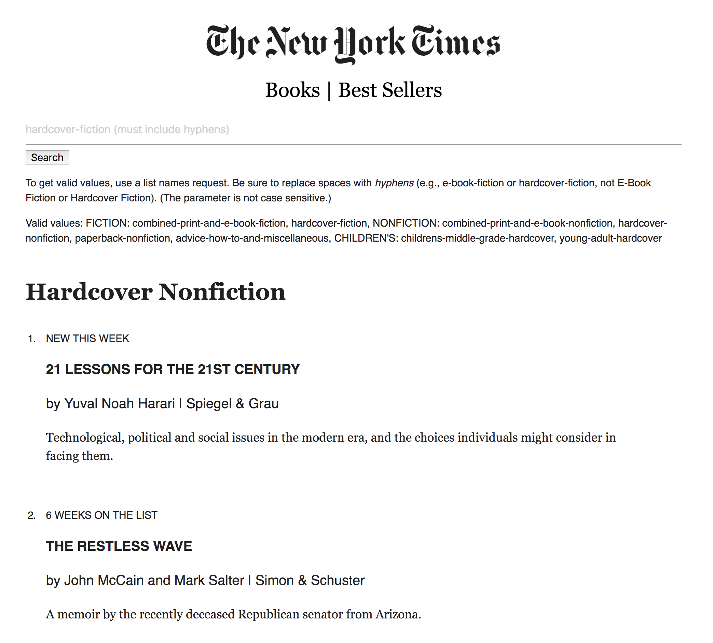

### New York Times Best Sellers Book list

Enter a valid search value to see a list of the week's best selling books!

### Deployed here: https://runhannah.github.io/react-nyt-books/

<kbd></kbd>

## Installation

Clone and cd into repository:

```
$ git clone https://github.com/RunHannah/react-nyt-books
```

_Requires node.js; instructions to install:_ https://www.learnhowtoprogram.com/javascript/getting-started-with-javascript-2f9a73dc-b7f5-4a22-9101-e69d49f552ac/installing-node-js

Install required npm packages and dependencies:

```
$ npm install
```

Sign up for an API key with the NYT times: http://developer.nytimes.com/
Under App.js file replace "process.env.REACT_APP_NYT_API_KEY" on line 29 with API key.

```
$ npm start
```

Runs the app in the development mode.<br>
Open [http://localhost:3000](http://localhost:3000) to view it in the browser.

### Licensed under MIT license

---

GNU GPL v2. Copyright 2018 **Hannah Lee**
